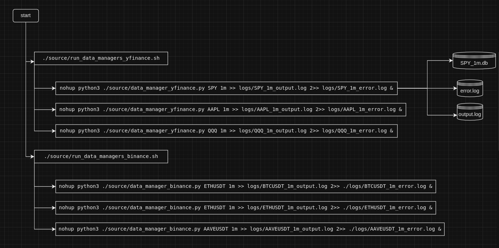

# Financial data manager 🪙

Scrape, download data and save into database each minute.



## Description

The code in this project performs the following tasks:

1. Downloads the last candlestick data for a specified financial asset using the `yfinance` library.
2. Saves the downloaded data into a SQLite database specified by the provided ticker and interval.
 
## Usage: start capturing datapoints

Run all streaming processes for both stock market and cryptocurrencies market.
   ```
./source/run_data_managers_binance.sh
./source/run_data_managers_yfinance.sh
   ```
or with a single stock market
   ```
nohup python3 ./source/data_manager_yfinance.py SPY 1m >> logs/SPY_1m_output.log 2>> logs/SPY_1m_error.log &
   ```
or with a single crypto
   ```
nohup python3 ./source/data_manager_binance.py ETHUSDT 1m >> logs/ETHUSDT_1m_output.log 2>> ./logs/ETHUSDT_1m_error.log &
   ```

   - `<ticker>`: The ticker symbol of the financial asset (e.g., stock symbol).
   - `<interval>`: The time interval for data (e.g., "1d" for daily, "1h" for hourly, etc.)


## Prerequisites

- Python 3.x
- Required libraries: `yfinance`, `sqlite3`

## Installation

1. Clone the repository or download the code files.
2. Install the required dependencies by running the following command:
   ```
   pip install yfinance
